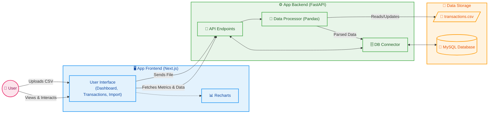

# Personal Expense Report ✨


🌎 **[Français (French Version)](#-version-française)** | 🇬🇧 **[English Version](#-english-version)**

---

## 🇬🇧 English Version

### About
**Personal Expense Report** is a financial dashboard for tracking personal expenses. 
It allows users to import bank statement files (CSV), automatically analyze, categorize, and save transactions in a database. It provides various visualizations and relevant metrics (KPIs) for effective budget management (Income / Expenses / Net Cashflow), as well as tracking recurring subscriptions and budgets.

### Tech Stack
The project was recently migrated to a modern decoupled stack:
- **Frontend / App:** Next.js (React), Tailwind CSS.
- **Backend / API:** FastAPI (Python).
- **Data Processing:** Pandas (CSV manipulation, filtering, date and category management).
- **Data Visualization:** Recharts (Time-series charts, cashflow histograms, and Sankey diagrams).
- **Database:** MySQL (communicating with the API via `mysql-connector-python`).
- **Deployment & Containerization:** Docker and Docker Compose.
- **Testing:** Jest & React Testing Library (Frontend), Pytest (Backend).

### Architecture



#### Component Breakdown
- **Next.js Frontend**: A modern, responsive SPA using Tailwind CSS for styling and Lucide icons.
- **FastAPI Backend**: A high-performance Python API handling business logic and data orchestration.
- **Pandas Processor**: Handles complex CSV manipulations, auto-categorization of expenses, and duplicate detection.
- **Hybrid Storage**: Uses `transactions.csv` for flat-file portability and **MySQL** for robust relational storage and persistence.

```text
personal-expense-report/
├── app-frontend/               # React Next.js Application (User Interface)
│   ├── src/
│   │   ├── app/                # Next.js Pages (Dashboard, Transactions, Budgets...)
│   │   └── components/         # React Components (Charts, UI, Layout)
│   ├── package.json            # Node.js Dependencies
│   └── tailwind.config.ts      # Tailwind CSS Configuration
├── app-backend/                # FastAPI Python API
│   ├── main.py                 # FastAPI Entry Point (REST Endpoints)
│   ├── db.py                   # MySQL Connector and SQL queries.
│   ├── data_processor.py       # CSV processing logic and auto-categorization.
│   └── tests/                  # Unit and integration test suite (Pytest).
├── tests/                      # Old global or e2e tests
├── sample-data/                # (Optional) Sample datasets.
├── docker-compose.yml          # Orchestration of app-frontend, app-backend and db (MySQL) services.
├── requirements.txt            # Python dependencies.
└── pyproject.toml              # Python project metadata (version, deps, tooling).
```

#### Data Lifecycle
1. **The user** uploads one or more `CSV` files from the Upload interface (or Drag & Drop in Transactions).
2. The FastAPI API via `data_processor.py` reads it, cleans it, checks for duplicates and applies auto-categorization based on the transaction "Description" column.
3. This newly normalized data is saved in the MySQL database via `db.py`.
4. **The user** can consult the "Dashboard" tab to visualize their expenses. The Next.js frontend queries the FastAPI endpoints to generate the Recharts graphics (Cashflow, KPIs, Sankey).

### How it works ?
The project is completely containerized. Without any software dependency other than Docker, you can run the application and its associated database.
- The backend (FastAPI) runs by exposing port **8000**.
- The frontend (Next.js) runs by displaying the interface on port **3000**.
- The DB (MySQL) runs in the background and guarantees data persistence (local persistent docker volume: `db_data`).

### Installation & Usage

#### Case A: Docker (Recommended)
The simplest way to run the project.

1. **Prerequisites**: [Docker Desktop](https://www.docker.com/products/docker-desktop/) installed.
2. **Clone & Build**:
   ```bash
   git clone https://github.com/DOX69/personal-expense-report.git
   cd personal-expense-report
   docker-compose up --build -d
   ```
3. **Access**: 
   - App: [http://localhost:3000](http://localhost:3000)
   - Docs: [http://localhost:8000/docs](http://localhost:8000/docs)

#### Case B: Windows Setup Guide (Manual)
Follow these steps to set up a full development environment on a fresh Windows machine.

1. **Install Dependencies**
Ensure you have the following installed:
- **Python 3.11+**: [Download here](https://www.python.org/downloads/windows/). *Check "Add Python to PATH" during installation.*
- **Node.js 18+**: [Download here](https://nodejs.org/).
- **Git**: [Download here](https://git-scm.com/download/win).
- **MySQL/MariaDB**: (Or use Docker for just the database: `docker-compose up db -d`).

2. **Clone the Project**
Open a Terminal (PowerShell or CMD) and run:
```powershell
git clone https://github.com/DOX69/personal-expense-report.git
cd personal-expense-report
```

3. **Backend Setup**
```powershell
# Create Virtual Environment
python -m venv .venv
.\.venv\Scripts\activate

# Install requirements
pip install -r requirements.txt

# Start Backend (API)
cd app-backend
uvicorn main:app --reload --port 8000
```

4. **Frontend Setup**
Open a *new* terminal window:
```powershell
cd personal-expense-report/app-frontend

# Install node packages
npm install

# Start Frontend (Dashboard)
npm run dev
```

5. **Verify the Installation**
- Navigate to `http://localhost:3000`.
- Go to the **Import** tab and upload a test CSV to populate the dashboard!

### Development

If you wish to contribute, make modifications or develop your own integrations.

#### Local Development Prerequisites
- Node.js `>= 18` (for the Next.js frontend)
- Python `>= 3.11` (for the FastAPI backend)
- An active local MySQL server *or* launched via docker: `docker-compose up db -d`

#### Database
Export the corresponding local credentials or install a `.env`:
```bash
export DB_HOST=localhost
export DB_USER=root
export DB_PASSWORD=rootpassword
export DB_NAME=expense_report
```

#### Backend (Python / FastAPI)
1. **Create a virtual environment:**
```bash
python -m venv .venv
source .venv/bin/activate       # MacOS / Linux
.\.venv\Scripts\activate        # Windows
```
2. **Installation and Launch:**
```bash
pip install -r requirements.txt
pip install -r app-backend/requirements-dev.txt # If exists
cd app-backend
uvicorn main:app --reload --host 0.0.0.0 --port 8000
```
3. **Backend Tests:**
```bash
python -m pytest tests/ -v
```

#### Frontend (Node.js / Next.js)
1. **Install dependencies:**
```bash
cd app-frontend
npm install
```
2. **Launch the development server:**
```bash
npm run dev
```
*(The frontend will run by default on http://localhost:3000)*
3. **Frontend Tests (Jest):**
```bash
npm run test
```

#### Git flow & TDD
We highly recommend a **Test-Driven-Development (TDD)** approach:
1. Write the test first by going into the `tests/` or `__tests__/` folders. A fail is guaranteed (**Red**)
2. Code the necessary logic to strict pass the test (**Green**)
3. Operate a **Refactoring** session while keeping the entire test suite valid.
Make sure it is *all green* before validating your feature (PR).

---

## 🇫🇷 Version Française

### A propos
**Personal Expense Report** est un tableau de bord financier de suivi de dépenses personnelles. 
Il permet d'importer des fichiers d'extraction bancaire (CSV), d'analyser, de classer et de sauvegarder automatiquement les transactions effectuées dans une base de données, pour ensuite proposer différentes visualisations et métriques (KPIs) pertinentes pour la bonne tenue d'un budget (Income / Expenses / Net Cashflow), ainsi que le suivi de budgets et d'abonnements récurrents.

### Tech Stack
Le projet a récemment été migré sur une stack moderne découplée :
- **Frontend / Application :** Next.js (React), Tailwind CSS.
- **Backend / API :** FastAPI (Python).
- **Data Processing :** Pandas (manipulation de CSV, filtrage, gestion des dates et catégories).
- **Data Visualization :** Recharts (Graphiques temporels, histogrammes de caisse, et diagrammes de Sankey).
- **Base de données :** MySQL (communicant à l'API via `mysql-connector-python`).
- **Déploiement / Conteneurisation :** Docker et Docker Compose.
- **Tests :** Jest & React Testing Library (Frontend), Pytest (Backend).

### Architecture


#### Component Breakdown
- **Next.js Frontend**: A modern, responsive SPA using Tailwind CSS for styling and Lucide icons.
- **FastAPI Backend**: A high-performance Python API handling business logic and data orchestration.
- **Pandas Processor**: Handles complex CSV manipulations, auto-categorization of expenses, and duplicate detection.
- **Hybrid Storage**: Uses `transactions.csv` for flat-file portability and **MySQL** for robust relational storage and persistence.

```text
personal-expense-report/
├── app-frontend/               # Application React Next.js (Interface utilisateur)
│   ├── src/
│   │   ├── app/                # Pages Next.js (Dashboard, Transactions, Budgets...)
│   │   └── components/         # Composants React (Graphiques, UI, Layout)
│   ├── package.json            # Dépendances Node.js
│   └── tailwind.config.ts      # Configuration de Tailwind CSS
├── app-backend/                # API FastAPI Python
│   ├── main.py                 # Point d'entrée FastAPI (Endpoints REST)
│   ├── db.py                   # Connecteur MySQL et requêtes SQL.
│   ├── data_processor.py       # Logique de traitement des CSV et auto-catégorisation.
│   └── tests/                  # Suite de tests unitaires et intégration (Pytest).
├── tests/                      # Anciens tests globaux ou e2e
├── sample-data/                # (Optionnel) Jeux de données d'exemple.
├── docker-compose.yml          # Orchestration des services app-frontend, app-backend et db (MySQL).
├── requirements.txt            # Dépendances Python.
└── pyproject.toml              # Métadonnées du projet python (version, deps, outillages).
```

#### Le Cycle de vie des données
1. **L'utilisateur** dépose un ou plusieurs `CSV` depuis l'interface Upload (ou Drag & Drop dans les Transactions).
2. L'API FastAPI via `data_processor.py` le lit, le nettoie, vérifie les doublons et va appliquer une auto-catégorisation basée sur la colonne "Description" des transactions.
3. Ces nouvelles données normalisées sont enregistrées en base de données MySQL via `db.py`.
4. **L'utilisateur** peut consulter l'onglet "Dashboard" pour visualiser ses dépenses. Le frontend Next.js interroge les endpoints FastAPI pour générer les graphiques Recharts (Cashflow, KPIs, Sankey).

### Comment ça marche ?
Le projet est entièrement conteneurisé. Sans aucune dépendance logicielle autre que Docker, vous pouvez faire tourner l'application et sa base de données associée.
- Le backend (FastAPI) tourne en exposant le port **8000**.
- Le frontend (Next.js) tourne en affichant l'interface sur le port **3000**.
- La BDD (MySQL) tourne en tâche de fond et garantit la persistance des données (volume docker persistant localement : `db_data`).

### Installation & Utilisation

#### Cas A: Docker (Recommandé)
Le moyen le plus simple d'exécuter le projet.

1. **Pré-requis**: [Docker Desktop](https://www.docker.com/products/docker-desktop/) installé.
2. **Cloner et Construire**:
   ```bash
   git clone https://github.com/DOX69/personal-expense-report.git
   cd personal-expense-report
   docker-compose up --build -d
   ```
3. **Accès**: 
   - App: [http://localhost:3000](http://localhost:3000)
   - Docs: [http://localhost:8000/docs](http://localhost:8000/docs)

#### Cas B: Guide d'installation Windows (Manuel)
Suivez ces étapes pour configurer un environnement de développement complet sur une machine Windows neuve.

1. **Installer les dépendances**
Assurez-vous d'avoir installé :
- **Python 3.11+**: [Télécharger ici](https://www.python.org/downloads/windows/). *Cochez "Add Python to PATH" lors de l'installation.*
- **Node.js 18+**: [Télécharger ici](https://nodejs.org/).
- **Git**: [Télécharger ici](https://git-scm.com/download/win).
- **MySQL/MariaDB**: (Ou utilisez Docker juste pour la base de données : `docker-compose up db -d`).

2. **Cloner le projet**
Ouvrez un terminal (PowerShell ou CMD) et exécutez :
```powershell
git clone https://github.com/DOX69/personal-expense-report.git
cd personal-expense-report
```

3. **Configuration du Backend**
```powershell
# Créer un environnement virtuel
python -m venv .venv
.\.venv\Scripts\activate

# Installer les dépendances
pip install -r requirements.txt

# Lancer le Backend (API)
cd app-backend
uvicorn main:app --reload --port 8000
```

4. **Configuration du Frontend**
Ouvrez une *nouvelle* fenêtre de terminal :
```powershell
cd personal-expense-report/app-frontend

# Installer les packages node
npm install

# Lancer le Frontend (Dashboard)
npm run dev
```

5. **Vérifier l'installation**
- Naviguez vers `http://localhost:3000`.
- Allez dans l'onglet **Import** et uploadez un CSV de test pour remplir le tableau de bord !

### Développement

Si vous souhaitez contribuer, apporter des modifications ou développer vos propres intégrations.

#### Pré-requis de développement local
- Node.js `>= 18` (pour le frontend Next.js)
- Python `>= 3.11` (pour le backend FastAPI)
- Un serveur MySQL local actif *ou* lancé via docker : `docker-compose up db -d`

#### Base de Données
Exportez les identifiants locaux correspondants ou installez un `.env` :
```bash
export DB_HOST=localhost
export DB_USER=root
export DB_PASSWORD=rootpassword
export DB_NAME=expense_report
```

#### Backend (Python / FastAPI)
1. **Créer un environnement virtuel :**
```bash
python -m venv .venv
source .venv/bin/activate       # MacOS / Linux
.\.venv\Scripts\activate        # Windows
```
2. **Installation et Lancement :**
```bash
pip install -r requirements.txt
pip install -r app-backend/requirements-dev.txt # S'il y a
cd app-backend
uvicorn main:app --reload --host 0.0.0.0 --port 8000
```
3. **Tests Backend :**
```bash
python -m pytest tests/ -v
```

#### Frontend (Node.js / Next.js)
1. **Installation des dépendances :**
```bash
cd app-frontend
npm install
```
2. **Lancer le serveur de développement :**
```bash
npm run dev
```
*(Le frontend tournera par défaut sur http://localhost:3000)*
3. **Tests Frontend (Jest) :**
```bash
npm run test
```

#### Git flow & TDD
Nous recommandons fortement une approche **Test-Driven-Development (TDD)** :
1. Ecrire d'abord le test en basculant dans les dossiers `tests/` ou `__tests__/`. Le fail est garanti (**Red**)
2. Coder la logique nécessaire au strict passage au test (**Green**)
3. Opérer une session de **Refactorisation** tout en gardant l'ensemble de la suite de tests valides.
Assurez-vous qu'elle est *all green* avant de valider votre fonctionnalité (PR).
